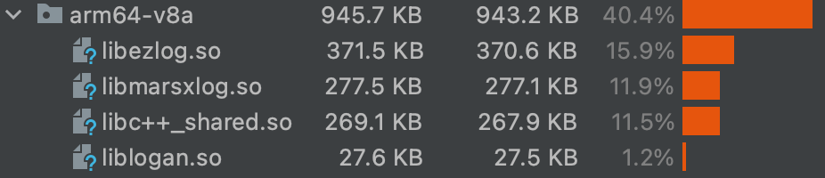
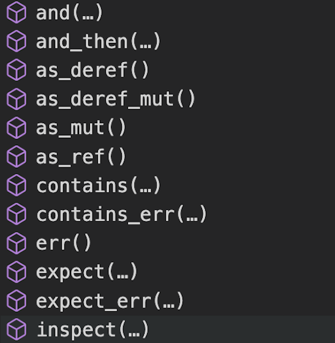
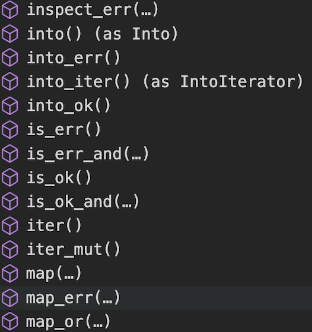
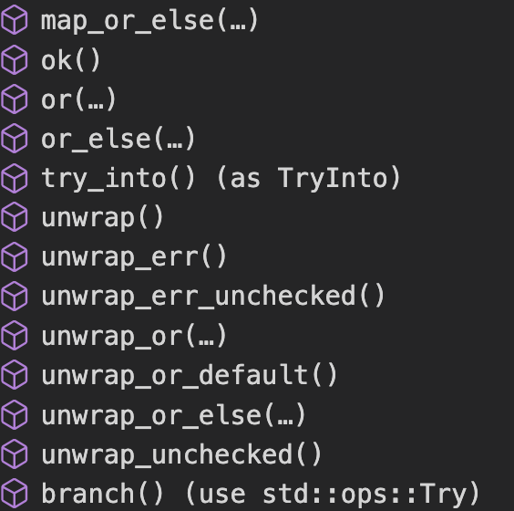

# 🦀️Rust 移动端开发体验

在过去的几周里，我根据 Xlog 和 Loagan 的设计思路，使用 Rust 写了一个移动端的跨平台日志库[EZLog](https://github.com/s1rius/ezlog)。</p>
在我实现这个库的过程中，查阅了大量的问答和博客。因为这些开发者的分享，节省了我大量的时间。所以我把我的经历也分享出来。</p>

如果以下任何一个点你感兴趣，不要划走。

- 当下(2022)Rust 在移动端的开发体验如何
- 没有 Java/Kotlin 代码，不使用 AndroidStudio 和 Gradle, 秒级编译并打包 Apk 运行
- Rust 编译静态库打包到 XCFramework, 发布 Cocoapods

### 起因

22 年初，我有一个游戏需求，要在 android 上实现匀速的贝塞尔曲线路径移动。依赖 [kurbo](https://github.com/linebender/kurbo)写了一个生成[贝塞尔曲线 LUT](https://youtu.be/aVwxzDHniEw?t=1058) 的命令行工具，体验很好。于是想尝试一下，发挥 Rust 的优势，在移动端写一个对性能有要求的开源库，第一个想到的就是日志。


### 可行性调查

#### 大型公司在移动端使用 Rust

- Google 在 2021 年将 Rust 引入 Android [Rust in the Android platform](https://security.googleblog.com/2021/04/rust-in-android-platform.html)
- Mozilla 使用 Rust 编写跨平台应用服务组件[Firefox Application Services](https://github.com/mozilla/application-services)
- [飞书客户端非 UI 部分使用 Rust 跨平台实现](https://www.infoq.cn/article/oh79weak7z3s2xavo*bv)

#### 个人开发者在移动端的尝试 Rust 的案例

- [Rust & cross-platform mobile development](https://medium.com/swlh/rust-cross-platform-mobile-development-9117a67ac9b7)
- [RustDesk 远程桌面应用](https://github.com/rustdesk/rustdesk)
- [深度探索：前端中的后端](https://zhuanlan.zhihu.com/p/347842418)
- [Publish game on Android with Macroquad](https://macroquad.rs/tutorials/android/)
- [Rust on iOS and Mac Catalyst: A Simple, Updated Guide](https://nadim.computer/posts/2022-02-11-maccatalyst.html)

更多的案例收录，可以参看这篇[Rust 移动开发与跨平台模式探究](https://zhuanlan.zhihu.com/p/484269271)。
从以上的例子来看，大概率是可行的，还要对具体的需求进行验证。

### 项目简述

#### 主要功能

- 使用 mmap 做文件映射
- 认证加密
- zlib 压缩
- 日志回捞
- 日志清理
- 命令行解析工具

#### 可行性验证

先查找主要功能是否有对应的 Rust 开源实现。

- [memmap2](https://github.com/RazrFalcon/memmap2-rs)
- [aead](https://github.com/RustCrypto/AEADs)
- [flate2](https://github.com/rust-lang/flate2-rs)

开源社区早已实现好了：）</br>
复制开源库中的示例，借助[android-ndk-rs](https://github.com/rust-windowing/android-ndk-rs)。在 android 真机运行，查看日志输出，符合预期。</br>
项目中使用`android ndk rs`的例子，可以查看`examples/android_preview`

<details>
<summary><b>编译成APK并安装运行不到5秒</b></summary>
</p>

```shell
cargo apk run -p ezlog_android_preview
   Compiling ezlog v0.1.2 (ezlog/ezlog-core)
   Compiling ezlog_android_preview v0.1.0 (ezlog/examples/android_preview)
    Finished dev [unoptimized + debuginfo] target(s) in 2.39s
 'lib/arm64-v8a/libezlog_android_preview.so'...
Verifying alignment of ezlog/target/debug/apk/ezlog_android_preview.apk (4)...
      49 AndroidManifest.xml (OK - compressed)
    1020 lib/arm64-v8a/libezlog_android_preview.so (OK)
Verification succesful
Performing Incremental Install
Serving...
All files should be loaded. Notifying the device.
Success
Install command complete in 949 ms
Starting: Intent { act=android.intent.action.MAIN cmp=rust.ezlog_android_preview/android.app.NativeActivity }
```

</details>


#### 项目结构

```
├── android
│   ├── app # android 示例工程
│   └── lib-ezlog # EZLog android 库
├── examples # rust 示例
├── ezlog-cli # 命令行工具
├── ezlog-core # 核心库
├── ios
│   ├── EZLog # EZLog iOS 库
│   ├── demo # iOS 示例工程
│   └── framework # EZLog XCFramework
```

### 开发中碰到的问题及解决

#### iOS

iOS 端的开发流程为

1. Rust 编码
2. 通过 [cbindgen](https://github.com/eqrion/cbindgen) 生成头文件
3. 编译多平台静态库
4. 把静态库和头文件打包成 XCFramework，并依赖
5. 实现 Swift 绑定
6. 测试，发布

在对比了多种依赖静态库的方式之后，发现[XCFramework](https://help.apple.com/xcode/mac/11.4/#/dev6f6ac218b)对多平台的支持，更适合这个项目。更多 XCFramework 的相关资料可以看这几篇文章[distributing universal ios frameworks as xcframeworks using cocoapods](https://anuragajwani.medium.com/distributing-universal-ios-frameworks-as-xcframeworks-using-cocoapods-699c70a5c961),
[Static libraries into XCFramework](https://developer.apple.com/forums/thread/678075?answerId=671170022#671170022),[From Rust To Swift](https://betterprogramming.pub/from-rust-to-swift-df9bde59b7cd)。在项目中的构建使用，可以参看`ios/b_ios.sh`脚本。</p>

Swift 与 C 的互相调用，很多概念需要了解。在被`Unmanaged`, `@escaping`,`@convention`,`UnsafePointer`,`UnsafeBufferPointer`,
`UnsafeMutableRawPointer` 折磨许久之后，终于可以在 Swift 中拿到 Rust 的回调了。</p>

Cocoapods 支持 XCFramework，尝试了 SPM，找不到符号的问题没有解决。暂时放一放。在花费了以天计的时间成本之后，终于在 Cocoapods 成功发布。</p>

对比一下三个包管理工具的从注册到发布的时间成本，从简单到繁琐的排序是 Cargo < Cocoapods < Maven。</p>

随着苹果在 XCode14 中废弃了 bitcode，Rust 在 iOS/MacOS 中最大的[痛点](https://github.com/rust-lang/rust/issues/35968)也就消失了。

#### android FFI

android 上 Rust 与 JNI 的互调和 C/C++的区别不大。同样要考虑变量的生命周期，全局的 JavaVM 引用，类加载到 JVM，native 线程在 JVM 的 attach 和 detach，详细的示例代码可以查看[jni-rs](https://github.com/jni-rs/jni-rs/blob/master/example/mylib/src/lib.rs)。

得益于 Rust 的生命周期管理，一些内存清理操作 Rust 已经处理了，不需要我们再手动的处理。

```rust
impl<'a: 'b, 'b> Drop for JavaStr<'a, 'b> {
    fn drop(&mut self) {
        match self.env.release_string_utf_chars(self.obj, self.internal) {
            Ok(()) => {}
            Err(e) => warn!("error dropping java str: {}", e),
        }
    }
}
```

#### android 动态库大小

因为用户对 RAM，流量的关心和 Android 版本向前兼容原因，android 开发中对包体积大小是敏感的。
对于 Rust 编译产物体积较大的问题，在查阅了[Minimizing Rust Binary Size](https://github.com/johnthagen/min-sized-rust)文章后，在 release 模式开启优化。

我们将 XLog，Logan 都加入到 Demo 的依赖中，对比 release apk 中的 64 位动态库大小，如图所示


|         | EZLog(0.1.2) | EZLog(with backtrace) | XLog(1.2.5) | XLog(with libc++) | Logan(1.2.4) |
| :------ | :----------: | :-------------------: | :---------: | :---------------: | :----------: |
| so 大小 |   370.6KB    |        451.6KB        |   277.1KB   |       537KB       |    27.5KB    |

Rust 编译的动态库大小是最大的，不过也没有太过于夸张，随着手机硬件的进一步提升，应该不会是制约 Rust 在 android 中应用的原因。

#### 崩溃？

不同的情况下，需要不同的方式

- 在开发，测试阶段，由于编写错误或者代码混淆等问题，导致类，方法无法找到的情况，我们希望程序能直接崩溃，尽早的暴露问题。
- 产品上线后，因为适配问题或者用户操作导致 bug 出现，导致某个模块的不可用。我们希望错误只限定在这个模块，不影响其他的功能，并上报这个错误

Rust 的错误分为可恢复和不可恢复的错误。Rust 初始化线程的 panic 会导致进程的退出。一些解决方法:

1. 只在需要崩溃时使用 panic 宏
2. 在 Clippy 中加入使用 unwrap 和 except 的警告
3. 替换 [start..end] 为 get(start..end)
4. FFI 中 catch_unwind

即使自己的代码中没有 panic 调用，依赖库中也可能会调用。所以需要提供在生产环境中崩溃排查的能力。

#### 崩溃排查

初始化时设置 panic hook。

```rust
#[cfg(not(feature = "backtrace"))]
fn hook_panic() {
    std::panic::set_hook(Box::new(|p| {
        event!(panic & format!("ezlog: \n {p:?}"));
    }));
}
```

在崩溃时会回调拿到 PanicInfo

```
PanicInfo { payload: Any { .. }, message: Some(asdf), location: Location { file: "ezlog-core/src/lib.rs", line: 119, col: 5 },
```

PanicInfo 中有错误信息，panic 的文件路径和代码位置。这样能粗略的排查 bug。
如果想拿到具体的堆栈信息，我们还需要依赖 backtrace，这样最后动态库的大小会增加 80KB 左右

```rust
#[cfg(feature = "backtrace")]
fn hook_panic() {
    std::panic::set_hook(Box::new(|p| {
        let bt = Backtrace::new();
        event!(panic & format!("ezlog: \n {p:?} \n{bt:?} \n"));
    }));
}
```

<details>
<summary><b>添加 backtrace 依赖后，iOS 的崩溃堆栈打印如下</b></summary>
</p>

```plaintext
 PanicInfo { payload: Any { .. }, message: Some(asdf), location: Location { file: "ezlog-core/src/lib.rs", line: 119, col: 5 }, can_unwind: true }
   0: backtrace::backtrace::trace_unsynchronized
   1: backtrace::backtrace::trace
   2: backtrace::capture::Backtrace::create
   3: backtrace::capture::Backtrace::new
   4: ezlog::init::{{closure}}
   5: std::panicking::rust_panic_with_hook
   6: std::panicking::begin_panic_handler::{{closure}}
   7: std::sys_common::backtrace::__rust_end_short_backtrace
   8: _rust_begin_unwind
   9: core::panicking::panic_fmt
  10: ezlog::init
  11: _ezlog_init
  12: _$s5EZLog18ezlogInitWithTraceyyF
  13: _$s4demo7DemoAppVACycfC
  14: _$s4demo7DemoAppV7SwiftUI0C0AadEPxycfCTW
  15: <unknown>
  16: _$s4demo7DemoAppV5$mainyyFZ
  17: _main

```

</details>

<details>
<summary><b>android logcat 输出的堆栈信息。</b></summary>
</p>

```plaintext
PanicInfo { payload: Any { .. }, message: Some(asdf), location: Location { file: "ezlog-core/src/lib.rs", line: 119, col: 5 }, can_unwind: true }
  0: <unknown>
  1: <unknown>
  2: <unknown>
  3: <unknown>
  4: <unknown>
  5: <unknown>
  6: <unknown>
  7: Java_wtf_s1_ezlog_EZLog_init
  8: art_quick_generic_jni_trampoline
  9: art_quick_invoke_static_stub
10: _ZN3art11interpreter34ArtInterpreterToCompiledCodeBridgeEPNS_6ThreadEPNS_9ArtMethodEPNS_11ShadowFrameEtPNS_6JValueE
11: _ZN3art11interpreter6DoCallILb0ELb0EEEbPNS_9ArtMethodEPNS_6ThreadERNS_11ShadowFrameEPKNS_11InstructionEtPNS_6JValueE
12: MterpInvokeStatic
13: mterp_op_invoke_static
14: _ZN3art11interpreterL7ExecuteEPNS_6ThreadERKNS_20CodeItemDataAccessorERNS_11ShadowFrameENS_6JValueEbb.llvm.3351068054637636664
15: _ZN3art11interpreter33ArtInterpreterToInterpreterBridgeEPNS_6ThreadERKNS_20CodeItemDataAccessorEPNS_11ShadowFrameEPNS_6JValueE
16: _ZN3art11interpreter6DoCallILb0ELb0EEEbPNS_9ArtMethodEPNS_6ThreadERNS_11ShadowFrameEPKNS_11InstructionEtPNS_6JValueE
17: MterpInvokeStatic
18: mterp_op_invoke_static
19: _ZN3art11interpreterL7ExecuteEPNS_6ThreadERKNS_20CodeItemDataAccessorERNS_11ShadowFrameENS_6JValueEbb.llvm.3351068054637636664
20: _ZN3art11interpreter33ArtInterpreterToInterpreterBridgeEPNS_6ThreadERKNS_20CodeItemDataAccessorEPNS_11ShadowFrameEPNS_6JValueE
```

</details>

<details>
<summary><b>systemserver 输出的崩溃日志如下</b></summary>
</p>

```
2022-07-07 15:25:50.712 14141-14141/? A/DEBUG: *** *** *** *** *** *** *** *** *** *** *** *** *** *** *** ***
2022-07-07 15:25:50.712 14141-14141/? A/DEBUG: Build fingerprint: 'google/flame/flame:12/SP2A.220305.012/8177914:user/release-keys'
2022-07-07 15:25:50.712 14141-14141/? A/DEBUG: Revision: 'MP1.0'
2022-07-07 15:25:50.712 14141-14141/? A/DEBUG: ABI: 'arm64'
2022-07-07 15:25:50.712 14141-14141/? A/DEBUG: Timestamp: 2022-07-07 15:25:50.559643355+0800
2022-07-07 15:25:50.712 14141-14141/? A/DEBUG: Process uptime: 0s
2022-07-07 15:25:50.712 14141-14141/? A/DEBUG: Cmdline: wtf.s1.ezlog.demo
2022-07-07 15:25:50.712 14141-14141/? A/DEBUG: pid: 14112, tid: 14112, name: f.s1.ezlog.demo  >>> wtf.s1.ezlog.demo <<<
2022-07-07 15:25:50.712 14141-14141/? A/DEBUG: uid: 10287
2022-07-07 15:25:50.712 14141-14141/? A/DEBUG: signal 6 (SIGABRT), code -1 (SI_QUEUE), fault addr --------
2022-07-07 15:25:50.712 14141-14141/? A/DEBUG:     x0  0000000000000000  x1  0000000000003720  x2  0000000000000006  x3  0000007fc9d51120
2022-07-07 15:25:50.712 14141-14141/? A/DEBUG:     x4  00000000ebad808a  x5  00000000ebad808a  x6  00000000ebad808a  x7  00000000ebad808b
2022-07-07 15:25:50.712 14141-14141/? A/DEBUG:     x8  00000000000000f0  x9  f7d7529acf61ddf5  x10 0000000000000000  x11 ffffff80fffffbdf
2022-07-07 15:25:50.712 14141-14141/? A/DEBUG:     x12 0000000000000001  x13 0000007fc9d50fe8  x14 0000000000000000  x15 0000000000000008
2022-07-07 15:25:50.712 14141-14141/? A/DEBUG:     x16 0000007b425b6050  x17 0000007b42592db0  x18 0000007b523fa000  x19 0000000000003720
2022-07-07 15:25:50.712 14141-14141/? A/DEBUG:     x20 0000000000003720  x21 00000000ffffffff  x22 0000000000000001  x23 0000000000000001
2022-07-07 15:25:50.712 14141-14141/? A/DEBUG:     x24 000000782576bad8  x25 00000078256bb708  x26 000000000000000b  x27 0000007b51553000
2022-07-07 15:25:50.712 14141-14141/? A/DEBUG:     x28 0000007fc9d514a0  x29 0000007fc9d511a0
2022-07-07 15:25:50.712 14141-14141/? A/DEBUG:     lr  0000007b42545aa0  sp  0000007fc9d51100  pc  0000007b42545acc  pst 0000000000000000
2022-07-07 15:25:50.712 14141-14141/? A/DEBUG: backtrace:
2022-07-07 15:25:50.712 14141-14141/? A/DEBUG:       #00 pc 000000000004facc  /apex/com.android.runtime/lib64/bionic/libc.so (abort+164) (BuildId: cd7952cb40d1a2deca6420c2da7910be)
2022-07-07 15:25:50.712 14141-14141/? A/DEBUG:       #01 pc 00000000000b3f1c  /data/app/~~eRgxj9PHRfJEC-cex2WWJw==/wtf.s1.ezlog.demo-ngUhJZd2NWtJpUNIWy5f_g==/lib/arm64/libezlog.so
2022-07-07 15:25:50.712 14141-14141/? A/DEBUG:       #02 pc 00000000000b22a8  /data/app/~~eRgxj9PHRfJEC-cex2WWJw==/wtf.s1.ezlog.demo-ngUhJZd2NWtJpUNIWy5f_g==/lib/arm64/libezlog.so
2022-07-07 15:25:50.712 14141-14141/? A/DEBUG:       #03 pc 00000000000b2164  /data/app/~~eRgxj9PHRfJEC-cex2WWJw==/wtf.s1.ezlog.demo-ngUhJZd2NWtJpUNIWy5f_g==/lib/arm64/libezlog.so
2022-07-07 15:25:50.712 14141-14141/? A/DEBUG:       #04 pc 00000000000b203c  /data/app/~~eRgxj9PHRfJEC-cex2WWJw==/wtf.s1.ezlog.demo-ngUhJZd2NWtJpUNIWy5f_g==/lib/arm64/libezlog.so
2022-07-07 15:25:50.712 14141-14141/? A/DEBUG:       #05 pc 00000000000b142c  /data/app/~~eRgxj9PHRfJEC-cex2WWJw==/wtf.s1.ezlog.demo-ngUhJZd2NWtJpUNIWy5f_g==/lib/arm64/libezlog.so
2022-07-07 15:25:50.712 14141-14141/? A/DEBUG:       #06 pc 00000000000b1e6c  /data/app/~~eRgxj9PHRfJEC-cex2WWJw==/wtf.s1.ezlog.demo-ngUhJZd2NWtJpUNIWy5f_g==/lib/arm64/libezlog.so
2022-07-07 15:25:50.712 14141-14141/? A/DEBUG:       #07 pc 00000000000c5ad0  /data/app/~~eRgxj9PHRfJEC-cex2WWJw==/wtf.s1.ezlog.demo-ngUhJZd2NWtJpUNIWy5f_g==/lib/arm64/libezlog.so
2022-07-07 15:25:50.712 14141-14141/? A/DEBUG:       #08 pc 000000000007550c  /data/app/~~eRgxj9PHRfJEC-cex2WWJw==/wtf.s1.ezlog.demo-ngUhJZd2NWtJpUNIWy5f_g==/lib/arm64/libezlog.so
2022-07-07 15:25:50.712 14141-14141/? A/DEBUG:       #09 pc 00000000000741ec  /data/app/~~eRgxj9PHRfJEC-cex2WWJw==/wtf.s1.ezlog.demo-ngUhJZd2NWtJpUNIWy5f_g==/lib/arm64/libezlog.so (Java_wtf_s1_ezlog_EZLog_init+28)
2022-07-07 15:25:50.712 14141-14141/? A/DEBUG:       #10 pc 00000000002d4044  /apex/com.android.art/lib64/libart.so (art_quick_generic_jni_trampoline+148) (BuildId: 46df93bc978921840e5b428398c66a57)
2022-07-07 15:25:50.712 14141-14141/? A/DEBUG:       #11 pc 00000000002ca9e8  /apex/com.android.art/lib64/libart.so (art_quick_invoke_static_stub+568) (BuildId: 46df93bc978921840e5b428398c66a57)
2022-07-07 15:25:50.712 14141-14141/? A/DEBUG:       #12 pc 00000000002ee6b8  /apex/com.android.art/lib64/libart.so (art::interpreter::ArtInterpreterToCompiledCodeBridge(art::Thread*, art::ArtMethod*, art::ShadowFrame*, unsigned short, art::JValue*)+320) (BuildId: 46df93bc978921840e5b428398c66a57)
2022-07-07 15:25:50.712 14141-14141/? A/DEBUG:       #13 pc 000000000040ade4  /apex/com.android.art/lib64/libart.so (bool art::interpreter::DoCall<false, false>(art::ArtMethod*, art::Thread*, art::ShadowFrame&, art::Instruction const*, unsigned short, art::JValue*)+820) (BuildId: 46df93bc978921840e5b428398c66a57)
2022-07-07 15:25:50.712 14141-14141/? A/DEBUG:       #14 pc 000000000076d4b8  /apex/com.android.art/lib64/libart.so (MterpInvokeStatic+3812) (BuildId: 46df93bc978921840e5b428398c66a57)
2022-07-07 15:25:50.712 14141-14141/? A/DEBUG:       #15 pc 00000000002c5014  /apex/com.android.art/lib64/libart.so (mterp_op_invoke_static+20) (BuildId: 46df93bc978921840e5b428398c66a57)
2022-07-07 15:25:50.712 14141-14141/? A/DEBUG:       #16 pc 00000000000790a2  [anon:dalvik-classes.dex extracted in memory from /data/app/~~eRgxj9PHRfJEC-cex2WWJw==/wtf.s1.ezlog.demo-ngUhJZd2NWtJpUNIWy5f_g==/base.apk] (wtf.s1.ezlog.EZLog.initWith+10)
2022-07-07 15:25:50.712 14141-14141/? A/DEBUG:       #17 pc 000000000027d840  /apex/com.android.art/lib64/libart.so (art::interpreter::Execute(art::Thread*, art::CodeItemDataAccessor const&, art::ShadowFrame&, art::JValue, bool, bool) (.llvm.3351068054637636664)+644) (BuildId: 46df93bc978921840e5b428398c66a57)
2022-07-07 15:25:50.712 14141-14141/? A/DEBUG:       #18 pc 000000000035a9e4  /apex/com.android.art/lib64/libart.so (art::interpreter::ArtInterpreterToInterpreterBridge(art::Thread*, art::CodeItemDataAccessor const&, art::ShadowFrame*, art::JValue*)+148) (BuildId: 46df93bc978921840e5b428398c66a57)
2022-07-07 15:25:50.712 14141-14141/? A/DEBUG:       #19 pc 000000000040b05c  /apex/com.android.art/lib64/libart.so (bool art::interpreter::DoCall<false, false>(art::ArtMethod*, art::Thread*, art::ShadowFrame&, art::Instruction const*, unsigned short, art::JValue*)+1452) (BuildId: 46df93bc978921840e5b428398c66a57)
2022-07-07 15:25:50.712 14141-14141/? A/DEBUG:       #20 pc 000000000076d4b8  /apex/com.android.art/lib64/libart.so (MterpInvokeStatic+3812) (BuildId: 46df93bc978921840e5b428398c66a57)
```

</details>

可以发现，android 的堆栈输出里并没有完整的 Rust 调用堆栈，我尝试通过[add2line](https://github.com/rust-windowing/android-ndk-rs/issues/101)的方法，但没有成功。

### 使用 Rust 的体验

- 学习曲线陡峭

我在读完 [Rust 官方文档](https://doc.rust-lang.org/book) 后，又跟着 [Rust 第一步](https://docs.microsoft.com/en-us/learn/paths/rust-first-steps/) 敲了一遍代码。发现这只是个开始，在看了一遍[Rust Nomicon](https://doc.rust-lang.org/nomicon/) [Rust Nomicon 中文](https://nomicon.purewhite.io)和[Async Book](https://rust-lang.github.io/async-book)之后，就已经想放弃了。太多晦涩的内容了，比如：`Unsafe`, `PhantomData`,`Send and Sync`, `Pin`...


直接一边写项目一边学吧。</br>

在实际的项目中，开源社区提供的解决方案有时会更合适。比如：`crossbeam_channel`, `tokio`, `once_cell`, `thiserror`等等，在 crates.io 上看开源项目文档也是学习的一部分。

- 文档

Rust 大部分库的文档，对读者很友好。详尽的描述，完整的示例。和 Java 的 concurrent 包的文档读着一样舒服。看这样的文档，好像就坐在作者的大脑皮层上看他写代码。
反观 iOS 和 Andriod 的一些文档，字里行间仿佛写着“你猜猜看这个怎么用”。


- 单元测试

易用的单元测试，随时添加`#[test]`就可以写一个测试用例。对比在 android 项目写一个测试用例，我还要先去搜索，有哪些依赖是需要添加的。
用 Rust 做开发，和系统 API 无关的业务逻辑，在桌面环境完成并测试，最后到对应的客户端验证。效率比起所有逻辑都在手机上验证高多了。

- 错误处理

Rust 可恢复错误强制处理，当我第一次看到 Result 那巨长的方法列表，就像看到大闸蟹身上一圈一圈的绳子，要不一剪刀(unwrap)了事？我们不想在库里直接 panic，就只能看文档了。避免图片过长，用了 3 张图显示:

<p align="center">
    
    &nbsp;
    
    &nbsp;
    
</p>

习惯了 try catch 的错误处理方式，刚开始处理 Result/Option 是懵的。通过文档示例和 Clippy 提示，花一些时间就能掌握。当我开始熟悉这样的错误处理方式，我不时会怀疑，之前是怎么在 Java/Kotlin 中只用 try catch 就能写完那些代码的。。。

- 生命周期和所有权

Rust 编译器的所有权/生命周期检查，必须在编码的时候就考虑对象的生命周期和内存的分配问题。对比 C/C++ 将编码的痛苦前置了。对比有 GC 的语音，心智成本大幅提高。

- 编译时间

debug 模式下

```
cargo clean && cargo build -p ezlog
Finished dev [unoptimized + debuginfo] target(s) in 14.19s
```

使用缓存，更改一行代码，再次编译

```
cargo build -p ezlog
Finished dev [unoptimized + debuginfo] target(s) in 1.46s
```

无缓存 release 模式下

```
target `aarch64-apple-ios`
Finished release [optimized] target(s) in 45.43s

target `aarch64-apple-ios-sim`
Finished release [optimized] target(s) in 40.83s

target `x86_64-apple-ios`
Finished release [optimized] target(s) in 39.26s

Building armeabi-v7a (armv7-linux-androideabi)
Finished release [optimized] target(s) in 47.64s

Building arm64-v8a (aarch64-linux-android)
Finished release [optimized] target(s) in 50.71s
```

在小型项目使用 Rust，基本没有编译摸鱼时间。对于移动端开发来说，有过无编译优化的中型项目的 Gradle 或者 XCode 构建体验，这点编译时间都不算事。</br>
如果想要加速 Android 端验证的效率，那么最好单独新增 crate，用[android-ndk-rs](https://github.com/rust-windowing/android-ndk-rs)这样的工具，动态获取 target，因为没有 Java/Kotlin 代码，跳过 gradle 的构建直接生成 APK 部署。

### 总结

#### 学习成本

对于新手，Rust 文档友好，社区活跃。还有官方支持的的包管理工具 Cargo，代码检查工具 Clippy。个人认为上手难度要低于 C++。

#### 开发效率

Rust 的学习曲线陡峭，编译器对借用，生命周期的检查。导致新手在初期开发效率低下。随着对语言熟悉程度的提高，以及易用的测试框架，方便的跨平台编译，可以弥补前期的开发效率劣势，加上 Rust 内存安全的特点，也降低了后期项目维护的难度。</p>

#### 适用

从 0 开始构建一个新的跨平台 App，所有的非 UI 逻辑，都使用 Rust 实现，构建成单一的静态/动态库，提供 FFI 支持。
Flutter/RN/Compose/SwiftUI 等等的框架做 UI 交互。在这种场景下使用 Rust 很合适。

但是如果想在现有的 App 中大量使用 Rust，那么二进制依赖是一个问题，如果有多个业务 crate，打包成多个二进制文件。那么各个 Rust 的产物可能会包含相同的依赖，比如 libc, syn, cfg-if, memchr等等。最后的包大小会随着业务的增多快速膨胀。

#### 后续

项目需要继续完善的地方

- [ ] Unsafe 代码审查
- [ ] 提供详细事件监控回调
- [ ] 文档完善
- [ ] 示例完善
- [ ] 性能测试
- [ ] GUI 支持

除了实现了 android，iOS 的跨平台，还有一些其他的使用场景。

- [x] 兼容 Windows，满足桌面端的需求。
- [x] 提供 Flutter MethodChannel SDK。
- [ ] 提供 Flutter FFI SDK。
- [ ] 给其他的库，游戏框架提供 log 插件，比如：[Bevy](https://github.com/bevyengine/bevy)，[Tauri](https://github.com/tauri-apps/tauri)。

#### Tips

- 添加 config，快速切换 target

在项目中添加 ./.cargo/config，并配置

```
[build]
target = "aarch64-linux-android"
...
```

注释掉其他的 target 后，在 vscode 中双击 shift 输入 >> 找到 reload workspace，就可以切换到对应的 target 了。

- 使用 thiserror 库来处理自定义的错误类型，可以省掉很多模版代码。

#### 参考文章及开源项目

- [mozilla multi platform arch design](https://mozilla.github.io/uniffi-rs/#design)
- [Android Rust crates](https://android.googlesource.com/platform/external/rust/crates)
- [Android Rust Introduction](https://source.android.com/setup/build/rust/building-rust-modules/overview?hl=en)
- [Flutter Rust Bridge](https://github.com/fzyzcjy/flutter_rust_bridge)

**FFI**

- [rust ffi doc](https://doc.rust-lang.org/nomicon/ffi.html)
- [how to call rust functions from c on linux h37](https://dev.to/dandyvica/how-to-call-rust-functions-from-c-on-linux-h37)
- [how does rust ffi pass parameters of type vec u8](https://users.rust-lang.org/t/how-does-rust-ffi-pass-parameters-of-type-vec-u8/55118)
- [How to return byte array from rust to c](https://users.rust-lang.org/t/how-to-return-byte-array-from-rust-function-to-ffi-c/18136)

**android**

- [Rust bindings to the JNI](https://docs.rs/jni/latest/jni/)
- [JNI crate exapmles](https://github.com/jni-rs/jni-rs/blob/master/example/mylib/src/lib.rs)
- [Implementing JNI_OnLoad](https://github.com/jni-rs/jni-rs/issues/257)
- [Rust on Android](https://mozilla.github.io/firefox-browser-architecture/experiments/2017-09-21-rust-on-android.html)
- [cargo ndk](https://github.com/bbqsrc/cargo-ndk)
- [Minimizing Rust Binary Size](https://github.com/johnthagen/min-sized-rust)
- [Rust 中的 bin, lib, rlib, a, so 概念介绍](https://rustcc.cn/article?id=98b96e69-7a5f-4bba-a38e-35bdd7a0a7dd)

**iOS**

- [Create your own CocoaPods library](https://medium.com/@jeantimex/create-your-own-cocoapods-library-da589d5cd270)
- [Building and Deploying a Rust library on iOS via Mozilla](https://mozilla.github.io/firefox-browser-architecture/experiments/2017-09-06-rust-on-ios.html)
- [Rust on iOS and Mac Catalyst](https://nadim.computer/posts/2022-02-11-maccatalyst.html)
- [recipe swift rust callback](https://www.nickwilcox.com/blog/recipe_swift_rust_callback/)

**其他**

- [Backtrace Capture on mobile in production enviroment](https://users.rust-lang.org/t/anybody-using-backtrace-capture-stack-trace-in-android-ios-should-backtrace-be-used-in-production-environments-mobile-phones-seems-that-iphone-with-arm-does-not-support-backtrace-at-all/65856)
- [Cannot get backtrace on Android](https://github.com/rust-lang/backtrace-rs/issues/442)
- [Gimli doesn't support iOS](https://github.com/rust-lang/backtrace-rs/issues/350)
- [Transform backtrace to string during catch unwind](https://stackoverflow.com/questions/68556819/transform-backtrace-to-string-during-catch-unwind)
- [Android backtraces don't work since gimli is used as the symbolizer](https://github.com/rust-windowing/android-ndk-rs/issues/101)
