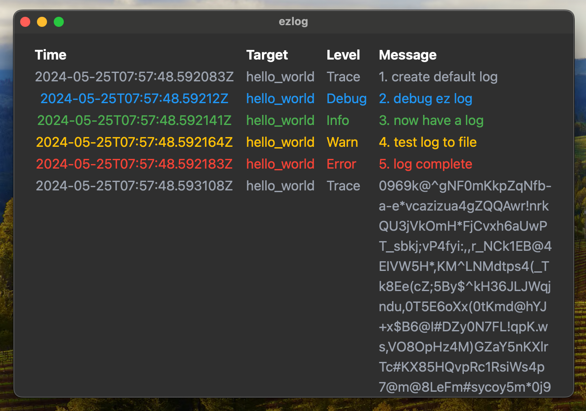

## Logs Query&View

### View Logs

If you want view a log file, you can use cmdline tools to parse the log, and open the output file in any text viewer application. Or you can download ezlog-ui application which is a desktop app built by tauri, it support decompress and decrypt. 

download at [release page]( https://github.com/s1rius/ezlog/releases/tag/ezlog-ui-0.1.0)

Open the app, and drag the log file to the window, you can see the log conent. 

